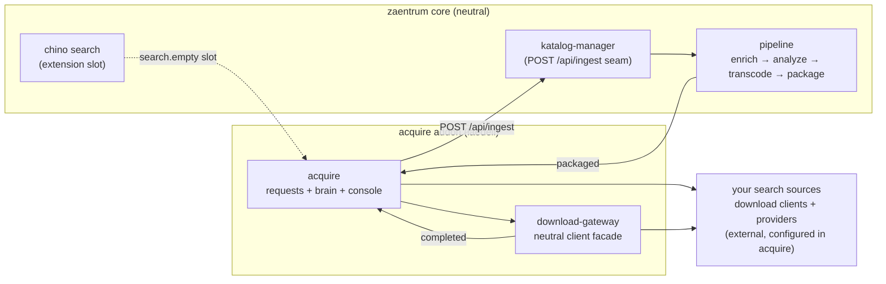

# acquire — the requests & downloads addon

**acquire** is the optional acquisition addon for the
[zaentrum](https://github.com/zaentrum/zaentrum) self-hosted media platform. It
adds three things to a running platform:

1. **Request** a movie or show you're entitled to add to your library.
2. **Fetch** it with **your own** download clients, behind one neutral API.
3. **Hand it to the catalog** so the platform's pipeline enriches, transcodes and
   packages it — and it becomes playable in the web / mobile / TV clients.

acquire is built for a library **you own and are entitled to stream**. It ships
**no search sources and no content** — you bring your own newznab/torznab
sources, download clients and (for usenet) news providers, and tell acquire
where they are in its console. acquire is only the wiring that turns a request
into a catalog item.

## The one idea: a neutral core, lit up by an addon

The platform core knows nothing about downloading. It ships only **extension
seams** — quiet, data-driven hooks. Install this addon and the seams light up: a
native **“Request this”** button appears where a search comes up empty, a
requests console appears at `/acquire`, and a whole download plane comes online.
**Uninstall it and the core is pristine again** — zero acquisition vocabulary,
zero leftover UI.

## Pick your path

| You want to… | Start here |
|---|---|
| **Understand how it fits together** (seams, events, the whole loop) | [Architecture](./architecture.md) |
| **Understand the request → play lifecycle** and the acquire service | [The acquire service](./acquire.md) |
| **Understand the download plane** (the gateway + its clients) | [Download gateway & clients](./download-gateway.md) |
| **Add search sources and set up NZB-first auto-grab** | [Search sources & NZB-first](./indexers-and-nzb.md) |
| **Install the addon on a platform** | [Deploying the addon](./deploying.md) |

## Where the code lives

| Repo | What it is |
|---|---|
| [`laedeli/acquire`](https://github.com/laedeli/acquire) | The addon service — requests, native newznab/torznab search, the request→grab→ingest brain, the configuration of sources and clients, and the embedded console. Image `ghcr.io/laedeli/acquire`. |
| [`laedeli/download-gateway`](https://github.com/laedeli/download-gateway) | A neutral facade that wraps any download client behind one HTTP API + a Kafka event stream. Image `ghcr.io/laedeli/download-gateway`. |

The **`laedeli`** org is the platform's addon shop — a “little shop” (_Lädeli_,
Swiss German) of optional capabilities you can add to a neutral core. The core
lives at [`zaentrum`](https://github.com/zaentrum); addons live here.

---

> These pages are generated from [`docs/`](https://github.com/laedeli/acquire/tree/main/docs)
> in the repo. Edit the docs there — a GitHub Action syncs this wiki automatically.
