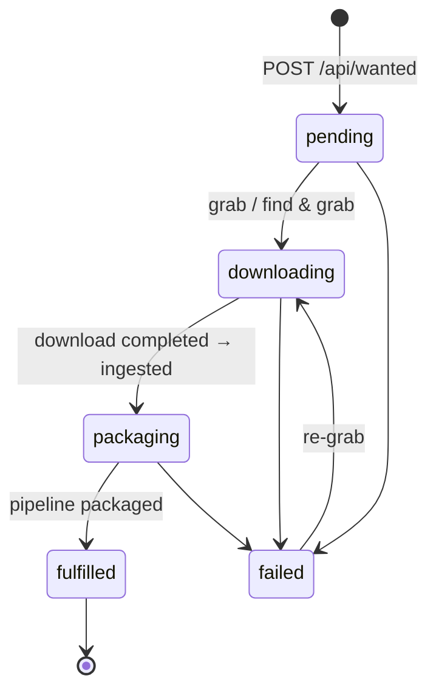

# The acquire service

`acquire` (Go, module `github.com/laedeli/acquire`) is the addon's brain and face.
It records requests, drives grabs, reacts to download and pipeline events, and
serves its own single-page console. The service mounts the SPA + API at its
**root**; the reference deploy exposes it under `/acquire` on the portal host (see
[Deploying the addon](./deploying.md)).

## Request lifecycle

A request is a **WantedItem**. Its `status` walks a small state machine:

- **pending** — the request exists (v1 is auto-approved: it simply waits for an
  admin to grab it).
- **downloading** — a source was handed to a download client. The detail line
  records how, e.g. `grabbed NZB from <indexer> via nzbget` or `grabbed via qbittorrent`.
- **packaging** — the download finished; acquire resolved the video file and
  ingested it (`ingested; pipeline running`).
- **fulfilled** — the pipeline packaged the item; it now plays in chino.
- **failed** — any of: grab error, indexer search error, no releases, download
  failed, no video file in the completed download, or ingest error. The detail
  line carries the reason. `pending` and `failed` requests are re-grabbable.

acquire reacts to these consumed events:

- `download.client.started` / `.progress` → record live telemetry (state, bytes,
  speed, ETA, seeders/health) and stream it to the console.
- `download.client.completed` → resolve the video file → `POST /api/ingest` →
  `packaging`. Idempotent: a repeat (e.g. after a gateway restart) is ignored
  once the request has moved past the download.
- `download.client.failed` → `failed` (with the client's error).
- `catalog.item.packaged` → look up the request by item id → `fulfilled`.

**Resolving the video file** from a completed download: acquire walks the download
folder on the shared media NFS and picks the **largest** file with a video
extension (`.mkv .mp4 .m4v .avi .mov .ts .webm`). It ingests that file *in place*
— no staging copy.

## HTTP API

Router: `go-chi`. Auth is an OIDC bearer verifier (issuer-only; roles from the
JWT `realm_access.roles`). If `OIDC_ISSUER` is unset, auth is disabled for local
dev (every caller is treated as admin).

| Method | Path | Who | Purpose |
|---|---|---|---|
| `GET` | `/healthz` | public | liveness |
| `GET` | `/readyz` | public | DB ping (503 when down) |
| `GET` | `/api/config` | public | SPA bootstrap: issuer, client id, admin role, `autoGrab` flag |
| `GET` | `/api/events` | any signed-in¹ | live stream: change pings + download telemetry |
| `GET` | `/api/wanted` | any signed-in | list requests |
| `POST` | `/api/wanted` | **user** or admin | create a request |
| `GET` | `/api/discover?q=` | any signed-in | TMDB search, flags in-library hits |
| `GET` | `/api/status?tmdbId=` | any signed-in | status of the newest request for a TMDB id |
| `POST` | `/api/wanted/{id}/grab` | **admin** | hand a magnet/URL to a client |
| `POST` | `/api/wanted/{id}/autograb` | **admin** | search indexers + grab the best release |
| `DELETE` | `/api/wanted/{id}` | **admin** | remove a request |
| `GET` | `/api/downloads` | any signed-in | live + recently finished downloads |
| `GET` | `/api/clients` | any signed-in | per-client health + aggregate speed |
| `POST` | `/api/downloads/{adapter}/{id}/{action}` | **admin** | `pause` \| `resume` \| `cancel` |
| `GET` | `/*` | public | the embedded SPA |

¹ The stream carries download telemetry (progress, speed, ETA), so it is
authenticated. Clients read it with **fetch-streaming** rather than
`EventSource`, which cannot send an `Authorization` header. It emits `changed`
(refetch the lists) and `download` (one telemetry row, applied in place).

### Roles

| Role (default) | Env | Can |
|---|---|---|
| `zaentrum-user` | `ACQUIRE_USER_ROLE` | request titles |
| `zaentrum-admin` | `ACQUIRE_ADMIN_ROLE` | request **+** grab, auto-grab, remove |

## The console

A Vite/React/TypeScript app on the nalet design system, built into the binary
with `go:embed` (source in `web/`, one container — no nginx sidecar). Auth is
`oidc-client-ts` Auth-Code + PKCE, so the session survives a reload and renews
silently. **Realm roles come from the ACCESS token** — the ID-token profile
oidc-client-ts exposes as `user.profile` carries none, so reading it makes every
user look like a non-admin.

Tabs:

- **requests** — status pill, chosen release, and a live progress bar with speed,
  ETA and the client's own state inline. Admin actions per row: **find & grab**
  (automatic pick), **releases** (interactive search — see below), **magnet**
  (paste a magnet/`.torrent` URL), **remove**.
- **downloads** — every client job with progress and telemetry, pause/resume/
  cancel, under per-client health chips (speed, free disk, active news servers).
- **discover** — TMDB search + request; in-library titles are marked.
- **indexers** — what is searched and in which order.

The **release picker** (`releases`) runs the same NZB-first search auto-grab uses
but shows the ranked candidates — protocol, indexer, size, seeders and *why* each
was ranked where it was — so an admin can override the automatic choice.
- **Live progress** — each downloading request shows a progress bar with speed,
  ETA and the client's own state; a **downloads** table lists every job with
  per-client health chips and pause/resume/cancel.
- **Live updates** — the SPA reads `/api/events` with fetch-streaming, applying
  `download` rows in place and refetching on a `changed` ping (30s fallback poll).

## Storage

acquire owns a small Postgres schema (applied on boot, idempotent):

**`wanted_items`** — `id`, `tmdb_id`, `media_type` (`movie`/`series`), `title`,
`year`, `poster_url`, `requested_by` (Keycloak sub), `requested_at`, `status`,
`detail` (last status message), `item_id` (catalog id once created), `updated_at`.

**`grabs`** — `wanted_id` (FK, cascade), `adapter`, `client_job_id`, `source`,
plus the release that won (`release_title`, `indexer`, `protocol`, `size_bytes`,
`seeders`, `reason`); PK `(wanted_id, adapter, client_job_id)`. Terminal events
normally map back via the `wanted_item_id` the gateway echoes; this table is the
fallback when a restarted gateway no longer knows it.

**`downloads`** — one row per client job (`adapter` + `client_job_id`): state,
the client's native state, bytes, speed, ETA, seeders/health, timestamps. This is
a *projection* of the clients' state, so `wanted_id` is a soft reference — a
download whose request was deleted simply loses the link. Terminal rows keep the
telemetry the progress stream accumulated, and are never resurrected by a late
progress message.

## Configuration

| Env | Default | Purpose |
|---|---|---|
| `ADDR` | `:8080` | listen address |
| `OIDC_ISSUER` | — | realm issuer (blank ⇒ auth disabled, dev only) |
| `ACQUIRE_OIDC_CLIENT_ID` | `laedeli-acquire` | public PKCE client id (for the SPA) |
| `ACQUIRE_ADMIN_ROLE` | `zaentrum-admin` | admin role |
| `ACQUIRE_USER_ROLE` | `zaentrum-user` | request role |
| `PG_URL` (`DATABASE_URL`) | — | Postgres URL |
| `DOWNLOAD_GATEWAY_URL` | — | the gateway base URL |
| `KATALOG_URL` | — | catalog read API (in-library check) |
| `KATALOG_MANAGER_URL` | — | ingest target |
| `OIDC_TOKEN_URL` | — | token endpoint for the service account |
| `ACQUIRE_SVC_CLIENT_ID` / `ACQUIRE_SVC_CLIENT_SECRET` | — | client-credentials for gateway + ingest calls |
| `TMDB_API_KEY` | — | discovery (optional) |
| `INDEXER_URL` / `INDEXER_API_KEY` | — | indexer search (blank ⇒ auto-grab off) |
| `ACQUIRE_PREFER` | `usenet` | ranking preference (`usenet` ⇒ NZB-first) |
| `KAFKA_BROKERS` | — | bootstrap (blank ⇒ consumer off, service stays up) |
| `KAFKA_CERT_DIR` | `/etc/kafka-cert` | mTLS cert dir (`user.crt`/`user.key`/`ca.crt`) |
| `KAFKA_TOPIC_PREFIX` | `zaentrum-beta.` | tenant prefix |
| `KAFKA_GROUP_ID` | `acquire` | consumer group |
| `ACQUIRE_DOWNLOADS_ROOT` | `/var/lib/katalog/packages/_downloads` | where the client saves (for path resolution) |

acquire calls the gateway and katalog-manager with a **service-account** token
(client-credentials), refreshed shortly before expiry, so those calls are
authenticated independently of any user.

## Next

- [Download gateway & clients](./download-gateway.md) — where the bytes come from.
- [Indexer search & NZB-first](./indexers-and-nzb.md) — how `find & grab` chooses.
