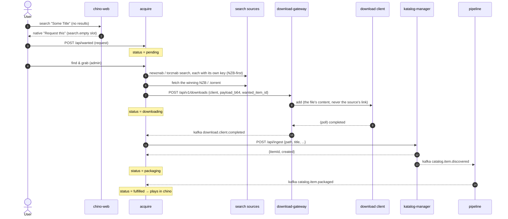
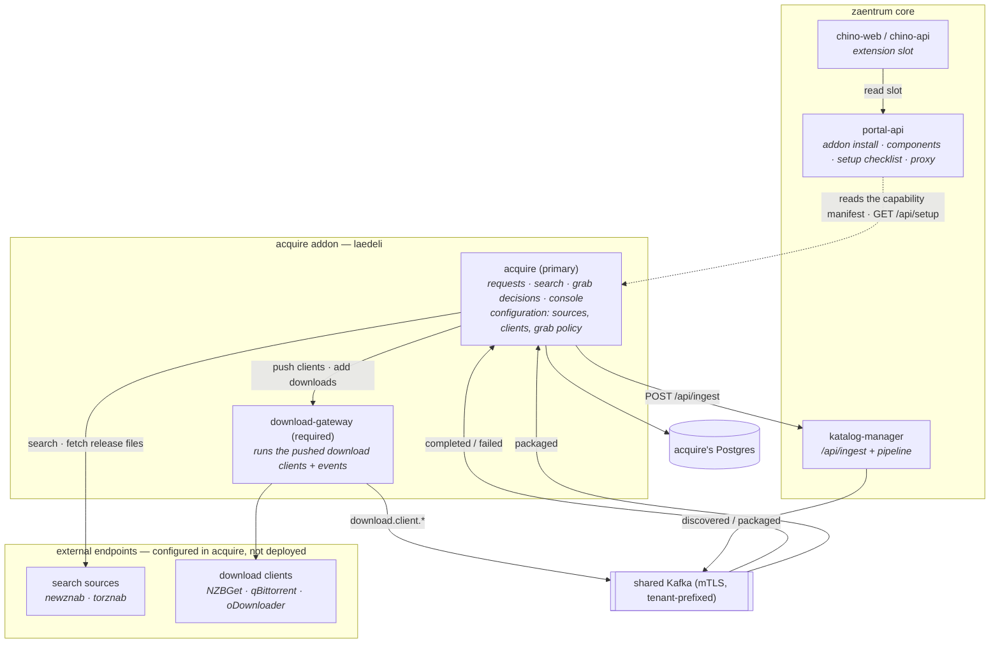

# Architecture

acquire is designed around one principle: **the platform core stays neutral, and
acquisition is an addon that plugs into two seams.** Nothing in the core mentions
requests or downloads; the addon is the only thing that does. This keeps the core
honest (it's a catalog + player for a library you own) and makes the whole
acquisition capability something you can add or remove cleanly.

> **Canonical contracts live platform-side.** This page explains how *acquire*
> uses the seams; the authoritative definition of each — the slot registry, the
> hosted-console federation contract, ingest, events, and addon identity — is
> the platform's [Extending zaentrum](https://github.com/zaentrum/zaentrum/wiki/extending)
> documentation. If this page and those ever disagree, those win.

## The two seams

The core exposes exactly two extension points. The addon uses both; the core
depends on neither.

### Seam 1 — the UI extension registry (a native button, zero coupling)

The portal keeps a tiny `ui_extensions` registry table. Each row says “in **this
slot**, show a button with **this label** that goes to **this URL**.” Product
clients read their slots and render whatever they find as a **native** button —
so the core ships the *socket*, and the addon ships the *plug*.

- The registry lives in **portal-api** (`ui_extensions` table, migration `006`).
  CRUD is gated to an admin **or** an addon service account (the `zaentrum-addon`
  realm role, `PORTAL_ADDON_ROLE`); the per-slot read (`GET /api/portal/slots/{slot}`)
  is open to any signed-in user.
- **chino-web** renders the slot. Its search page mounts
  `<ExtensionSlot slot="search.empty">` — shown only when a search returns no
  titles and no people. In the core, that slot is empty, so **nothing renders**.
- **chino-api** forwards the browser's bearer to portal-api best-effort
  (`GET /api/v1/extensions?slot=`); an unreachable or unset portal simply yields
  an empty slot.

acquire *declares* the row in its capability manifest; the platform creates it
when an admin installs the addon (see [deploying](./deploying.md#install-it-in-the-portal)):

```json
"slots": [
  { "key": "search-request", "slot": "search.empty", "kind": "link",
    "label": "Request this", "icon": "download",
    "url": "/portal/app/acquire?q={q}#/discover", "ord": 10 }
]
```

Now “no results for _X_” grows a **Request this** button. Remove the addon and
the button is gone — the core never knew its name.

### Seam 2 — the neutral ingest contract (a file becomes a catalog item)

katalog-manager exposes `POST /api/ingest`: hand it an absolute path to a file
that already lives on the platform's storage, plus a title/type, and it creates a
catalog item + primary playback asset and **emits `catalog.item.discovered`** —
exactly what the scanner does for files it finds on its own. It “knows nothing of
where the file came from.”

- The path must sit under the media root **or** the packages root (guarded).
- It's **idempotent on the path**: re-ingesting a known file returns the existing
  item and fires nothing (no duplicate, no re-pipeline).
- `discovered` is the pipeline's front door — enrich → analyze → transcode →
  package all follow from it.

This is the seam that lets an addon put content into the catalog **without**
reaching into the catalog's internals. acquire owns one invariant here: it ingests
the finished download's video file *in place* (no staging copy), and lets the
pipeline take it from `discovered` onward.

## Event-driven by design

acquire **consumes** platform events and emits none of its own beyond its
internal schedule ticks (`acquire.schedule.due`, `acquire.schedule.saga.due`).
It reacts to events and issues commands at the edges (request, search, grab,
ingest) over plain HTTP. The bus carries the truth; HTTP carries the intent.



**Topics** (all carry a tenant prefix, e.g. `zaentrum-beta.`):

| Topic | Producer | acquire |
|---|---|---|
| `download.client.started` / `.progress` | download-gateway | ignored |
| `download.client.completed` | download-gateway | **consumed** → ingest |
| `download.client.failed` | download-gateway | **consumed** → mark failed |
| `catalog.item.discovered` | katalog-manager (on ingest) | — (drives the pipeline) |
| `catalog.item.packaged` | katalog-manager (pipeline) | **consumed** → mark fulfilled |

acquire's consumer starts at the **latest** offset (only new events; history is
not replayed) and is poison-safe (undecodable messages are skipped).

## Component map

The addon is two workloads. Search sources and download clients are external
endpoints: acquire stores where they are — keys and passwords encrypted with
`ACQUIRE_CONFIG_KEY` — and edits them in its console. The portal shows the
component group and acquire's setup checklist, and never sees a configuration
value.



| Component | Workload | Emits |
|---|---|---|
| `acquire` (primary) | `acquire` | `acquire.schedule.due`, `acquire.schedule.saga.due` |
| `download-gateway` (required) | first label of `DOWNLOAD_GATEWAY_URL`'s host | `download.client.started`, `.progress`, `.completed`, `.failed` |

The manifest also declares the setup checklist: `GET /api/setup` answers
`ready`, `needs-setup` or `degraded` for **sources** and **clients** (required)
and **grab-policy** (optional), and each section links to the console tab that
edits it.

## The neutral-core property, restated

Every seam degrades to nothing:

- **Zero registry rows** → `ExtensionSlot` renders `null`; an unreachable portal →
  chino-api returns `[]`. No button, no trace.
- **Re-ingest of a known path** → no new item, no event. Idempotent.
- **No search sources / no download clients configured** → the gateway runs no
  clients, auto-grab is off, and the setup checklist says what is missing. The
  service stays up.

That's what makes acquisition an *addon* and not a fork: install it for the whole
capability, remove it for a clean, neutral platform.

## Next

- [The acquire service](./acquire.md) — the request lifecycle, API, SPA and schema.
- [Download gateway & clients](./download-gateway.md) — the download plane.
- [Search sources & NZB-first](./indexers-and-nzb.md) — where acquire searches and how auto-grab picks a release.
- [Deploying the addon](./deploying.md) — installing it on a platform.
