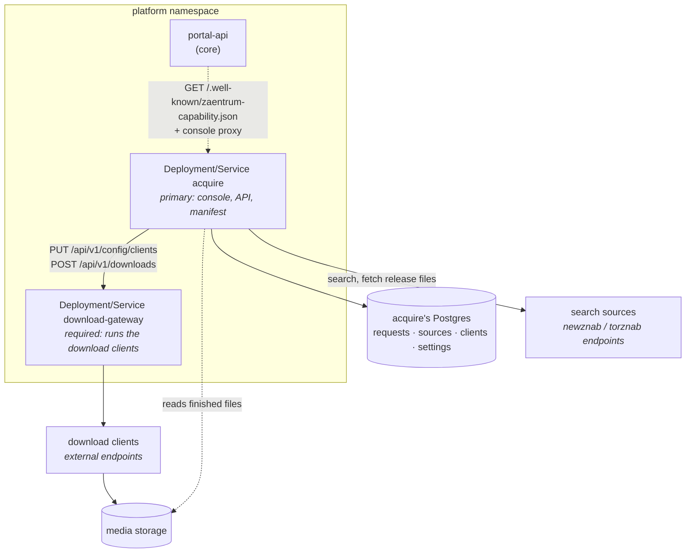

# Deploying the addon

acquire is **two containers**: `acquire` itself and `download-gateway`. That
is the whole deployment. The programs that download and the sources that are
searched are **not** part of it — they are endpoints you already run or use,
and an admin tells acquire where they are in its console after the install.
Nothing third-party is deployed, bundled or configured through manifests.

The shapes below are plain Kubernetes and match the platform's
[installing addons](https://github.com/zaentrum/zaentrum/wiki/extending-installing)
guide: you deploy the components through your own channel, then install the
addon in the portal.



## Prerequisites

- A running **zaentrum core** with the ingest seam (katalog-manager
  `POST /api/ingest`) and the portal's addon install.
- The **shared Kafka** the core uses (mTLS).
- An **OIDC realm** you can add two clients to.
- A **Postgres database** for acquire.
- The **media storage** the download clients write to, mountable into acquire
  so it can find finished files.

## The components

| Component | Role | Image | Port | Needs |
|---|---|---|---|---|
| `acquire` | primary | `ghcr.io/laedeli/acquire` | 8080 | Postgres, media storage (read-only), the config key |
| `download-gateway` | required | `ghcr.io/laedeli/download-gateway` | 8080 | nothing stored — clients are pushed to it at runtime |

Name each Deployment and its Service after the component's workload (`acquire`
and `download-gateway`) and carry the grouping labels in **metadata** only,
never in a selector:

```yaml
apiVersion: apps/v1
kind: Deployment
metadata:
  name: download-gateway
  labels:
    zaentrum.io/addon: acquire
    zaentrum.io/component: download-gateway
spec:
  selector:
    matchLabels: { app: download-gateway }   # selectors stay your own
```

No Ingress or Route is needed: the portal proxies acquire's console and API.
The gateway workload acquire declares is the first label of the host in
`DOWNLOAD_GATEWAY_URL` (`http://download-gateway` → `download-gateway`); if
you rename the gateway, keep the two in step.

Both images run as non-root on a distroless base and need no extra privileges.

## Identity

| Client | Type | Used for |
|---|---|---|
| `laedeli-acquire` | public (PKCE) | the standalone console login (`ACQUIRE_OIDC_CLIENT_ID`) |
| `laedeli-acquire-svc` | confidential (client credentials) | acquire's own calls: the gateway (downloads and client configuration) and ingest |

Realm roles: `zaentrum-user` may request, `zaentrum-admin` may grab, remove and
**configure** — every configuration route is admin-only.

The gateway validates acquire's service token. Set on the gateway:

| Env | Value |
|---|---|
| `OIDC_ISSUER` | the realm issuer |
| `ALLOWED_CLIENTS` | `laedeli-acquire-svc` |

Only with both set does the gateway accept calls from that client alone **and**
offer its client configuration API; without them acquire cannot push download
clients and setup says so.

## Secrets

| Secret | Key | Read as |
|---|---|---|
| `acquire-db` | `url` | `PG_URL` |
| `acquire-svc-oidc` | `client-secret` | `ACQUIRE_SVC_CLIENT_SECRET` |
| `acquire-config` | `key` | `ACQUIRE_CONFIG_KEY` |
| `katalog-tmdb` | `api-key` | `TMDB_API_KEY` (optional mount) |
| `kafka-mtls` | `user.crt`, `user.key`, `ca.crt` | created by the core deploy |

Nothing else: search source keys and download client passwords are **not**
deployment secrets. They are entered in acquire's console and stored in its
database, encrypted.

### ACQUIRE_CONFIG_KEY

The key that encrypts every credential acquire stores — search source API keys,
download client passwords and tokens, and the full release links grabs keep.
It is 32 random bytes, base64:

```bash
openssl rand -base64 32
```

- **Without it** acquire runs, but refuses to store a credential (`409`) and
  its setup checklist reports it. There is never a plaintext fallback.
- **Rotating:** set the new key as `ACQUIRE_CONFIG_KEY` and the old one as
  `ACQUIRE_CONFIG_KEY_PREVIOUS`. Stored values keep opening; everything written
  from then on is sealed with the new key. Re-enter the credentials, then drop
  the previous key.
- **Losing it** makes the stored credentials unreadable: setup shows which
  sources and clients are affected, and they have to be entered again. acquire
  pushes nothing to the gateway while a client secret cannot be opened, so a
  wrong key never empties a running gateway.

Keep it out of logs and backups of the database it protects.

## acquire's environment

The deployment-level settings. Everything an admin edits later — sources,
clients, the search and grab policy — is **not** here.

| Env | Purpose |
|---|---|
| `OIDC_ISSUER`, `ACQUIRE_OIDC_CLIENT_ID`, `ACQUIRE_ADMIN_ROLE`, `ACQUIRE_USER_ROLE` | auth |
| `PG_URL` | acquire's database |
| `DOWNLOAD_GATEWAY_URL` | e.g. `http://download-gateway` |
| `KATALOG_URL`, `KATALOG_MANAGER_URL` | catalog read and ingest |
| `OIDC_TOKEN_URL`, `ACQUIRE_SVC_CLIENT_ID`, `ACQUIRE_SVC_CLIENT_SECRET` | the service account |
| `KAFKA_BROKERS`, `KAFKA_CERT_DIR`, `KAFKA_TOPIC_PREFIX`, `KAFKA_GROUP_ID` | events |
| `ACQUIRE_DOWNLOADS_ROOT` | where finished downloads are visible to acquire when a client names no folder of its own |
| `ACQUIRE_CONFIG_KEY`, `ACQUIRE_CONFIG_KEY_PREVIOUS` | credential encryption (above) |
| `ACQUIRE_ENDPOINT_DENY` | hosts acquire must never be pointed at (below) |
| `ACQUIRE_ENDPOINT_ALLOW_INTERNAL` | `true` to allow cluster services in other namespaces |
| `POD_NAMESPACE` | acquire's own namespace (downward API); read from the service account otherwise |

`ACQUIRE_PREFER`, `ACQUIRE_STORAGE_FLOOR_GB` and `ACQUIRE_MAX_CONCURRENT_GRABS`
only seed the search and grab settings on the first boot; the console owns them
from then on. See [the acquire service](./acquire.md#configuration) for the
full list.

### Where configuration may point

Configuration makes acquire connect to whatever address an admin types, from
inside the cluster. Every search source and download client address — and
every link acquire fetches for them — goes through one policy:

- `http` and `https` only, with no credentials in the address;
- never a link-local or cloud metadata address (`169.254.0.0/16`, `fe80::/10`,
  `100.100.100.200`, `fd00:ec2::254`), checked on save and again on the
  resolved address at connect time;
- nothing listed in `ACQUIRE_ENDPOINT_DENY` — a comma list of hostnames and
  domain suffixes (`.other-namespace.svc,files.example.org`). Use it to keep a
  test instance from ever reaching production endpoints;
- no `*.svc` / `*.svc.cluster.local` service in another namespace unless
  `ACQUIRE_ENDPOINT_ALLOW_INTERNAL=true`. acquire's own namespace and private
  (RFC 1918) addresses stay allowed;
- responses are size-capped, and a redirect may not switch scheme.

## Storage paths

A download client reports finished files as **it** sees them. For each client
acquire keeps two folders: the save folder *as the client sees it* (sent to the
client with every add) and the same folder *as acquire sees it*. Mount the
storage into acquire read-only so the second path exists; free-space checks run
against it too.

## Install it in the portal

> portal → settings → **addons** → address `http://acquire` → **check** → **install**

portal-api reads acquire's manifest and records:

| Declared | Result |
|---|---|
| `components` | `acquire` (primary) and `download-gateway` (required), matched by workload name — **check** shows a gateway you forgot to deploy as *not deployed* |
| `setup` | the checklist from `GET /api/setup`: **search sources** and **download clients** (required), **search and grab** (optional), each with a **configure** link into acquire's console |
| `ui` | the `acquire` app and launchpad section, its tiles (requests, downloads, search, search sources, clients, quality profiles) and the **Request this** row in the `search.empty` slot |

acquire writes nothing to the portal and needs no credential for this. The
portal never sees a configuration value — it shows the checklist states and
links to where they are edited.

## Configure it

Right after install the checklist reads *needs setup*. Follow its
**configure** links:

1. **Download clients** — add each external download client: type, address,
   credentials, the protocols it handles, and the two folders. acquire pushes
   the set to the gateway immediately and whenever the gateway restarts.
2. **Search sources** — add each newznab or torznab endpoint with its API key
   and categories; acquire reads its caps on save. See
   [Search sources & NZB-first](./indexers-and-nzb.md).
3. **Search and grab** — which protocol is searched first, the free-space floor
   and how many downloads may run at once.

A manual search answers within 50 seconds. Whatever sits between the browser
and acquire must allow at least a minute per request.

## Verifying

- `GET /api/setup` on acquire (or the portal's checklist) reads `ready`.
- `GET /api/v1/config/clients` on the gateway reports the same revision the
  clients tab shows.
- `GET /api/health/system` has no failing `sources` or `clients` check.
- A request → **find & grab** moves `pending → downloading` with a detail line
  naming the source and the client, then `packaging → fulfilled`, and plays.

## Upgrading from an earlier deployment

Earlier deployments ran the download clients and an indexer aggregator next to
acquire and configured them through environment variables and secrets.

1. Deploy the new images. Remove `INDEXER_URL` / `INDEXER_API_KEY` from acquire
   (acquire logs a line while they are still set) and add
   `ACQUIRE_CONFIG_KEY`. Add `OIDC_ISSUER` and `ALLOWED_CLIENTS` to the gateway.
2. Add the download clients and search sources in the console. The first client
   of each type is named after the type (`nzbget`, `qbittorrent`), so downloads
   and grabs recorded before keep resolving.
3. Remove the third-party Deployments, Services, service accounts and their
   secrets from your overlay — acquire no longer needs them in the namespace.
   Remove the client variables from the gateway too: acquire routes grabs only
   to the clients it stores, and an environment client would block a stored
   client of the same id.
4. **Refresh** the addon in the portal so it learns the component group and the
   setup checklist.

## Uninstalling

1. Settings → addons → **remove**. The app, tiles, slot row and section go; the
   answer lists the addon's workloads that are still deployed.
2. Delete those workloads through the channel that deployed them — the
   `zaentrum.io/addon=acquire` label finds them.
3. Drop acquire's database when you no longer need the data. All of its
   configuration lives there and nowhere else.

The core is a neutral catalog and player again — exactly as before the addon.
