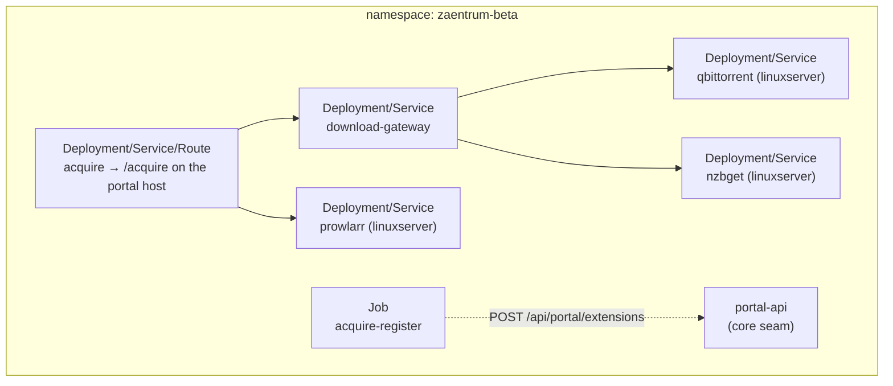

# Deploying the addon

This describes how the addon is installed on the platform's reference environment
(OpenShift/OKD, GitLab CI GitOps). The shapes generalise to any Kubernetes; the
specifics below match the `zaentrum-beta` reference deployment.

## Prerequisites

- A running **zaentrum core** that exposes the two seams (portal-api
  `ui_extensions`, katalog-manager `POST /api/ingest`) and the `zaentrum-addon`
  realm role.
- A **shared Kafka** reachable over mTLS (the core already uses it), and a
  **media NFS** mounted into the addon pods (downloads and the catalog share it).
- An **OIDC realm** you can add two clients to.
- The addon images: `ghcr.io/laedeli/acquire` and
  `ghcr.io/laedeli/download-gateway`.

## Identity: two OIDC clients + roles

| Client | Type | Used for |
|---|---|---|
| `laedeli-acquire` | public (PKCE) | the SPA login (`ACQUIRE_OIDC_CLIENT_ID`) |
| `laedeli-acquire-svc` | confidential (client-credentials) | acquire → gateway + ingest calls, and the self-registration job. Carries the `zaentrum-addon` realm role. |

Roles: `zaentrum-user` (request), `zaentrum-admin` (grab/auto-grab/remove),
`zaentrum-addon` (manage only this addon's extension-registry rows).

## The overlay

The reference deploy is a Kustomize overlay (`zaentrum-beta/addons/`) with six
components:



| Component | Image | Port | Storage |
|---|---|---|---|
| acquire | `ghcr.io/laedeli/acquire` | 8080 | media NFS (read-only), own Postgres |
| download-gateway | `ghcr.io/laedeli/download-gateway` | 8080 | — |
| qbittorrent | `linuxserver/qbittorrent` | 8080 | media NFS; saves to `packages/_downloads` |
| nzbget | `linuxserver/nzbget` | 6789 | media NFS; saves to `packages/_downloads` |
| prowlarr | `linuxserver/prowlarr` | 9696 | media NFS `subPath: packages/_config/prowlarr` |

acquire's `Route` serves the SPA + API at `/acquire` on the portal host. Two
annotations matter:

- `haproxy.router.openshift.io/rewrite-target: /` — acquire serves at root, so the
  `/acquire` prefix is stripped.
- `haproxy.router.openshift.io/timeout: 300s` — the default 30s route timeout is
  too short for an indexer search; raise it (this is the same fix class as the
  classic “manual search 504”).

### The `linuxserver` images need `anyuid`

The `linuxserver` images use an s6 init that needs to start as root, which the
default restricted SCC forbids. Each of `qbittorrent`, `nzbget`, `prowlarr` gets
its **own ServiceAccount** bound to the `anyuid` SCC. That binding is a
**cluster-admin, one-time** step in `bootstrap.yaml` — the CI deployer cannot
grant SCC use itself. acquire and the gateway are distroless-nonroot and need no
such binding.

## Secrets (created by CI from variables)

The `deploy:zaentrum-beta-addons` job creates:

| Secret | Key(s) | From CI var |
|---|---|---|
| `acquire-db` | `url` | `ACQUIRE_DB_URL` |
| `acquire-svc-oidc` | `client-secret` | `ACQUIRE_SVC_SECRET` |
| `katalog-tmdb` | `api-key` | `ACQUIRE_TMDB_KEY` (optional — `optional: true` mount) |
| `prowlarr-api` | `api-key` | `INDEXER_API_KEY` |
| `nzbget-control` | `user`=`nzbget`, `password` | `NZBGET_CONTROL_PASS` |
| `nzbget-conf` | `nzbget.conf` | `NZBGET_CONF_B64` (base64) |

The CI job only creates a secret when its variable is set. But `acquire`
references `prowlarr-api` and `download-gateway` references `nzbget-control`
**without** `optional: true` — so if you deploy the full overlay (which includes
the indexer aggregator and NZBGet), set `INDEXER_API_KEY`, `NZBGET_CONTROL_PASS` and
`NZBGET_CONF_B64`, or those pods won't start. Only `katalog-tmdb` is a truly
optional mount. The shared `kafka-mtls` secret is created by the core deploy, not
the addon.

## Self-registration → the “Request this” button

A one-shot `Job` (`acquire-register`) waits for portal-api, mints a
client-credentials token for `laedeli-acquire-svc`, and upserts one extension row:

```
POST http://portal-api/api/portal/extensions
{ "key":"acquire.search-request", "addon":"acquire", "slot":"search.empty",
  "kind":"link", "label":"Request this", "icon":"download",
  "url":"https://<host>/acquire/?q={q}", "ord":10, "enabled":true }
```

This is what makes a native **Request this** button appear under an empty chino
search. It's idempotent (upsert by key) and re-runs on each deploy. Removing the
row — or the addon — removes the button and leaves the core neutral.

## Bring your own indexer config + providers

Two components are yours to populate:

- **the indexer aggregator** stores its indexers (and their keys) in its own database + `config.xml`
  under `packages/_config/prowlarr` on the NFS. Seed it with your own indexers;
  put its API key in the `prowlarr-api` secret.
- **NZBGet** needs a `nzbget.conf` with your **news providers** (host/port/SSL/
  connections/credentials) and control credentials, seeded from `nzbget-conf`.
  Downloads land under `packages/_downloads`.

Nothing here is bundled — the addon supplies the wiring; you supply the indexers,
keys and providers for a library you're entitled to build.

## Verifying

- `GET /api/v1/clients` on the gateway lists your live adapters (e.g.
  `["qbittorrent","nzbget"]`).
- The chino search-empty state shows **Request this**.
- A request → **find & grab** advances `pending → downloading` with a detail line
  naming the indexer + adapter, then `packaging → fulfilled` as the pipeline runs,
  and finally plays in chino.

## Uninstalling

Delete the overlay. The registration row goes with it (or delete it explicitly),
the button disappears, and the core is a neutral catalog + player again — exactly
as before the addon.
