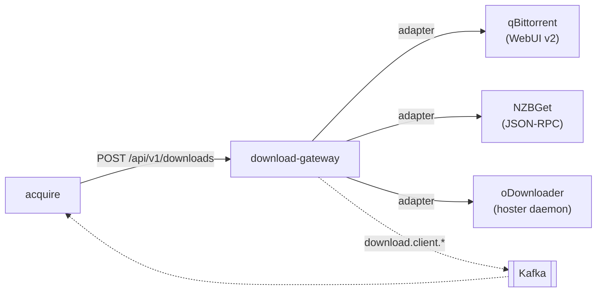

# Download gateway & clients

[`laedeli/download-gateway`](https://github.com/laedeli/download-gateway) is a
small Go service that puts **one neutral API and one event stream** in front of
whatever download clients you run. acquire talks only to the gateway; the gateway
talks to the clients. Swap a client and nothing upstream changes.



## The adapter model

Every client is an **adapter** behind one interface:

```go
type Adapter interface {
    Name() string
    Add(ctx, Job) (clientJobID string, err error)
    Status(ctx, clientJobID string) (Status, error)
    Describe(ctx, clientJobID string) (JobView, error)
    Remove(ctx, clientJobID string) error
}
```

A `Job` carries a `Source` (torrent URL / magnet / NZB URL / hoster link), an
optional `SavePath` and a `Title`. `Status` is one of `queued`, `downloading`,
`completed`, `failed`. `Describe` returns a `JobView` (state, bytes done/total,
speed, ETA, and — on completion — the absolute file paths).

Adapters are registered **only when configured** — an unconfigured client is
omitted, not stubbed. `GET /api/v1/clients` lists exactly the ones that are live
(e.g. `["qbittorrent","nzbget"]`).

### Built-in adapters

| Adapter | Speaks | Enabled by | Notes |
|---|---|---|---|
| **qBittorrent** | WebUI API **v2** | `QBITTORRENT_BASE_URL` | tags each add with a unique `dlg-…` tag and uses that as the stable job id (qB's add returns no id). Remove is **non-destructive** (`deleteFiles=false`). |
| **NZBGet** | JSON-RPC (`/jsonrpc`) | `NZBGET_URL` | adds by URL via `append` (NZBGet fetches it); job id is the NZBID. See the DupeMode note below. |
| **oDownloader** | static-token JSON API | `ODOWNLOADER_BASE_URL` | one add = a package of N hoster links; job id is the package id. |
| JDownloader | — | (stub) | present as a type, not wired in. |

**NZBGet `DupeMode="FORCE"`.** The gateway's `append` call sets `DupeMode="FORCE"`.
An empty DupeMode is rejected by NZBGet as an invalid enum, so the gateway always
sends a valid one; `FORCE` also guarantees a requested item is never silently
deduped away.

**Non-destructive Remove.** qBittorrent's delete passes `deleteFiles=false`:
removing a job leaves the files on disk. acquire owns cleanup of the download
folder — the gateway never deletes content.

## HTTP API

The `/api/*` routes are wrapped by an **optional** OIDC bearer verifier: set
`OIDC_ISSUER` and every call must carry a valid bearer (issuer-only, no audience
check); leave it unset and the API is unauthenticated (back-compat, for when the
gateway runs on a private network behind acquire). Validation is lazy and
self-healing — it recovers on its own when the IdP comes up.

| Method | Path | Purpose |
|---|---|---|
| `GET` | `/healthz` | liveness |
| `GET` | `/metrics` | Prometheus |
| `GET` | `/api/v1/clients` | list registered adapters |
| `POST` | `/api/v1/downloads` | enqueue a download → `202 {adapter, client_job_id}` |
| `GET` | `/api/v1/downloads` | tracked in-flight jobs |
| `DELETE` | `/api/v1/downloads/{adapter}/{id}` | remove a job (204) |

`POST /api/v1/downloads` body:

```json
{ "adapter": "nzbget", "source": "<url|magnet>", "title": "…",
  "save_path": "…", "wanted_item_id": "w_…" }
```

`adapter` + `source` are required; an unknown adapter is `404`, an adapter error
is `502`. The `wanted_item_id` is stamped onto the job and echoed on the
`completed` event, so acquire maps a finished download back to its request.

## Events (the source of truth)

A background poll loop `Describe`s each tracked job (`POLL_INTERVAL`, default 5s)
and publishes JSON events to Kafka over **mTLS** (Strimzi client cert — not
SASL/OAuth). Topics are `<KAFKA_TOPIC_PREFIX>download.client.<kind>`:

| Topic | When | Carries |
|---|---|---|
| `…download.client.started` | on a successful add | `wanted_item_id`, title |
| `…download.client.progress` | each poll while running | state, %, bytes, speed, eta |
| `…download.client.completed` | poll sees completion | `wanted_item_id`, **`files[]`**, size |
| `…download.client.failed` | poll sees failure | `error` (a `retriable` flag is reserved but always `false` today) |

`KAFKA_TOPIC_PREFIX` defaults to `stube.`; a tenant sets e.g. `zaentrum-beta.` so
its topics are `zaentrum-beta.download.client.*`. If Kafka isn't configured the
publisher runs in log-only mode and the service stays up.

## Configuration

| Env | Default | Purpose |
|---|---|---|
| `DOWNLOAD_GATEWAY_ADDR` | `:8080` | listen address |
| `POLL_INTERVAL` | `5s` | job poll cadence |
| `OIDC_ISSUER` | — | blank ⇒ API unauthenticated |
| `KAFKA_BROKERS` | — | bootstrap (`:9093` TLS listener) |
| `KAFKA_TLS_CERT` / `KAFKA_TLS_KEY` / `KAFKA_TLS_CA` | — | mTLS material |
| `KAFKA_TOPIC_PREFIX` | `stube.` | tenant prefix |
| `QBITTORRENT_BASE_URL` / `QBITTORRENT_USER` / `QBITTORRENT_PASS` | — | enable qBittorrent |
| `NZBGET_URL` / `NZBGET_USER` / `NZBGET_PASS` / `NZBGET_CATEGORY` | — | enable NZBGet |
| `ODOWNLOADER_BASE_URL` / `ODOWNLOADER_TOKEN` | — | enable oDownloader |

## Next

- [Indexer search & NZB-first](./indexers-and-nzb.md) — how acquire chooses which
  `source`/`adapter` to hand the gateway.
- [Deploying the addon](./deploying.md) — the download-plane manifests.
