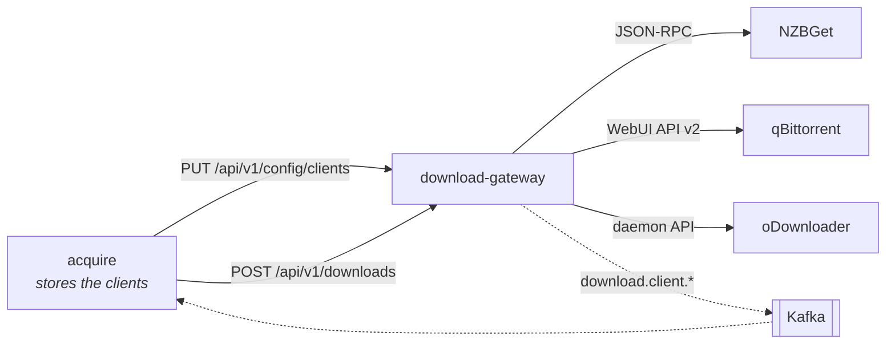

# Download gateway & clients

[`laedeli/download-gateway`](https://github.com/laedeli/download-gateway)
(module `github.com/laedeli/download-gateway`) is a small Go service that puts
**one API and one event stream** in front of the download clients you run.
acquire talks only to the gateway; the gateway talks to the clients, tracks
every job until it finishes, and publishes the lifecycle as events.

The download clients are **external endpoints**. Neither the gateway nor
acquire deploys or bundles them. acquire stores which clients exist and how to
reach them, and pushes that to the gateway; the gateway holds it in memory and
runs them.

## Clients

A **client** is one configured instance of an adapter type compiled into the
gateway. Its id (`^[a-z0-9][a-z0-9-]{0,39}$`) is fixed for its lifetime: jobs,
events and acquire's download records all refer to it.

| Type | Protocols | Auth | Release file | Save path | Pause |
|---|---|---|---|---|---|
| `nzbget` | `usenet` | `basic`, `none` | NZB content via `append` | the client's category decides | yes |
| `qbittorrent` | `torrent` | `basic`, `none` | `.torrent` as a multipart upload | yes | yes |
| `odownloader` | `http` | `token`, `none` | refused — hoster links only | — | — |

- **NZBGet** `append` always sends `DupeMode=FORCE`, so a requested item is
  never silently deduplicated away.
- **qBittorrent** returns no id from an add, so every add carries a unique
  `dlg-…` tag that becomes the job id. Removing a job never deletes files.
- **oDownloader** takes hoster links; one add is one package.

`GET /api/v1/config/types` lists the types with these capabilities; acquire's
client dialog is built from it.

## Where clients come from

**acquire (the normal case).** Clients are edited in acquire's console under
**clients** and stored in acquire's database, secrets encrypted. acquire pushes
the full set of enabled clients:

- at start,
- right after every change,
- every 30 seconds when the gateway reports a different revision (a gateway
  restart comes back empty, at revision `0`),
- and once more when an add fails because the gateway does not know the client,
  before retrying that add once.

A push replaces every pushed client at once. Unchanged clients keep running
with their sessions; changed or new ones are rebuilt and adopt their running
jobs. A removed client that still has jobs keeps being polled until they finish
but accepts no new downloads — and acquire refuses to delete a client while
downloads are in flight on it. acquire logs only client ids and revisions,
never a secret. If a stored secret cannot be opened, acquire pushes nothing
rather than a smaller set.

**The gateway's environment.** `NZBGET_*`, `QBITTORRENT_*` and `ODOWNLOADER_*`
still create a client each, with the type name as its id and source `env`. They
cannot be replaced or removed through the API, and a pushed client with the same
id is refused. A push refused in part applies its valid clients, but the
gateway keeps reporting its previous revision and acquire shows the reason on
the clients screen and in setup. acquire offers that same set again after one
interval, then waits twice as long each time up to 10 minutes — at once when
the stored clients change or the gateway reports something different running —
and logs the refusal once, not on every attempt. acquire routes grabs only to
the clients it stores: an
environment client shows up in the downloads tab's client health, but no grab
is sent to it.

## How acquire routes a grab

A release goes to the **enabled client that handles its protocol, lowest
priority first** — the protocol preference in settings decides only when a
link's kind is unknown. When none handles it, the grab is refused with “no
download client handles torrent — add one under download clients”.

For each add acquire sends:

| Field | Value |
|---|---|
| `client` (alias `adapter`) | the client id |
| `payload_b64` + `payload_name` | the NZB or `.torrent` acquire fetched itself |
| `source` | instead of a payload: a magnet or a hoster link |
| `save_path` | the client's save folder *as the client sees it* |
| `category` | the client's category (default `acquire`) |
| `title`, `wanted_item_id` | the request, echoed on the `completed` event |

A source's download link is never sent: it carries the source's API key, which
would then live in the client's history, logs and API. See
[Search sources & NZB-first](./indexers-and-nzb.md#keys-never-leave-acquire).

When a download completes, acquire maps the reported file paths from the
client's folder to the same folder as acquire sees it, then ingests the video.

## HTTP API

| Method | Path | Purpose |
|---|---|---|
| `GET` | `/healthz` | liveness |
| `GET` | `/readyz` | readiness: the process and the event publisher are up (zero clients is still ready) |
| `GET` | `/metrics` | Prometheus |
| `GET` | `/api/v1/clients` | ids of the clients that accept new downloads |
| `GET` | `/api/v1/clients/status` | per-client health and throughput (`id`, `type`, `reachable`, speeds, detail) |
| `POST` | `/api/v1/downloads` | add a download → `202 {adapter, client, client_job_id}` |
| `GET` | `/api/v1/downloads` | tracked in-flight jobs with their last snapshot |
| `DELETE` | `/api/v1/downloads/{client}/{id}` | remove a job from its client |
| `POST` | `/api/v1/downloads/{client}/{id}/pause` · `/resume` | pause or resume, where the type supports it |
| `GET` | `/api/v1/config/types` | the adapter types a client can be created from |
| `GET` | `/api/v1/config/clients` | `{revision, clients}` — every client, never a secret |
| `PUT` | `/api/v1/config/clients` | atomically replace every pushed client → `{revision, applied, errors}` |
| `POST` | `/api/v1/config/clients/test` | probe one client without registering it |

An add body is capped (a 50 MiB NZB fits); an unknown client is `404`, a client
removed while it still has jobs is `409`, a client error is `502`. Secrets are
write-only: `GET /api/v1/config/clients` reports `secretSet`.

### Authentication

| `OIDC_ISSUER` | `ALLOWED_CLIENTS` | `/api/v1/*` | `/api/v1/config/*` |
|---|---|---|---|
| unset | — | unauthenticated | `404` |
| set | unset | any valid bearer from the issuer | `404` |
| set | set | a bearer whose `azp` (or `client_id`) is listed, else `403` | enabled |

Pushing configuration points the gateway at arbitrary endpoints, so the
configuration API only exists when callers are restricted to named clients.
For acquire, list its service client: `ALLOWED_CLIENTS=laedeli-acquire-svc`.

Pushed clients never connect to a link-local or cloud metadata address, follow
redirects only within their own scheme and host, and ignore proxy variables.

## Events (the source of truth)

A poll loop describes each tracked job (`POLL_INTERVAL`, default `5s`) and
publishes JSON to Kafka over mTLS on `<KAFKA_TOPIC_PREFIX>download.client.<kind>`:

| Topic | When | Carries |
|---|---|---|
| `…download.client.started` | an add succeeded | `wanted_item_id`, title |
| `…download.client.progress` | each poll while running | state, native state, %, bytes, speed, ETA, peers or health |
| `…download.client.completed` | the client reports completion | `wanted_item_id`, **`files[]`**, size |
| `…download.client.failed` | the client reports failure, or the job vanished | `error` |

Every event carries `client_id` (the job id at the client), `adapter` (the
client id) and `client_type`. Without Kafka the publisher runs in log-only mode
and the service stays ready. In acquire's capability manifest these topics
belong to the `download-gateway` component, which is where they come from.

## Configuration

| Env | Default | Purpose |
|---|---|---|
| `DOWNLOAD_GATEWAY_ADDR` | `:8080` | listen address |
| `POLL_INTERVAL` | `5s` | job poll cadence |
| `OIDC_ISSUER` | — | require bearer tokens from this issuer |
| `ALLOWED_CLIENTS` | — | OIDC client ids allowed to call; enables the configuration API |
| `KAFKA_BROKERS` | — | bootstrap servers (TLS listener) |
| `KAFKA_TLS_CERT` / `KAFKA_TLS_KEY` / `KAFKA_TLS_CA` | — | mTLS material |
| `KAFKA_TOPIC_PREFIX` | `stube.` | topic namespace — set your tenant prefix, e.g. `zaentrum-beta.` |
| `NZBGET_*`, `QBITTORRENT_*`, `ODOWNLOADER_*` | — | optional environment clients (see above) |

With acquire, the gateway needs no client variables at all.

## Next

- [Search sources & NZB-first](./indexers-and-nzb.md) — how acquire chooses the
  release it hands the gateway.
- [Deploying the addon](./deploying.md) — the two components and their
  settings.
