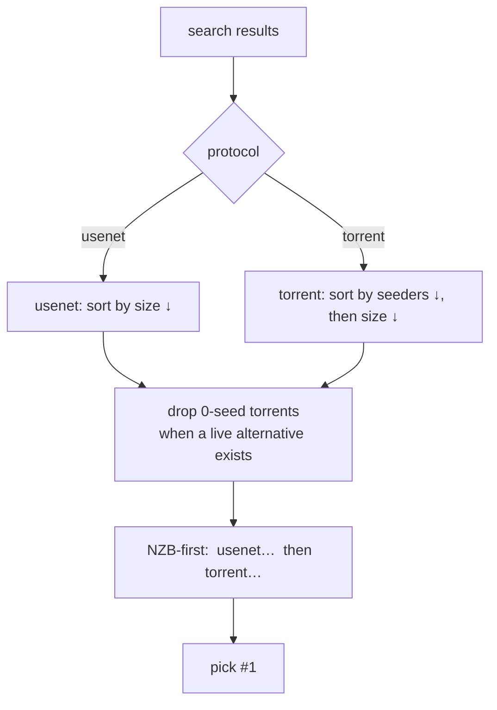
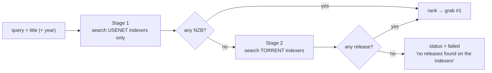

# Indexer search & NZB-first

Manual grabbing (paste a magnet, hand it to a client) always works. On top of
that, acquire can **search your indexers and grab the best release by itself** —
the “find & grab” button. This page explains how that decision is made and why it
prefers NZB (usenet) over torrents.

acquire ships **no indexers**. It searches an indexer aggregator that **you**
run and configure with your own indexers and keys.

## The search backend

acquire does not ship or manage indexers. It talks to an **indexer aggregator**
that you run, which holds your indexer definitions and credentials and returns
one merged, protocol-tagged result set. Today acquire speaks that aggregator's
v1 HTTP API rather than the indexer protocols directly; a native client is
planned, so treat this as the current integration and not a permanent boundary.

- `GET {INDEXER_URL}/api/v1/indexer` — the configured indexers (`id`, `name`,
  `protocol` = `usenet`|`torrent`, `enable`).
- `GET {INDEXER_URL}/api/v1/search?query=…&type=search&limit=100` — a unified
  search; each hit is a `Release{protocol, title, indexer, size, seeders,
  downloadUrl, magnetUrl}`. Requests carry `X-Api-Key`. The search can be scoped
  to specific `indexerIds`.

Auto-grab turns on only when both `INDEXER_URL` and `INDEXER_API_KEY` are set.
The older `INDEXER_URL` / `INDEXER_API_KEY` spellings are still read, so an
existing deployment keeps working unchanged.

## Ranking: NZB-first

With `ACQUIRE_PREFER=usenet` (the default), releases are ranked so **every NZB
comes before any torrent**:

- **Usenet** is ordered by size (bigger ≈ higher quality for a single title).
- **Torrents** are ordered by seeders, then size.
- **Dead torrents** (0 seeders) are dropped when any live alternative (an NZB or a
  seeded torrent) exists.
- Setting `ACQUIRE_PREFER` to any value other than `usenet` flips the order to
  torrent-first. Leaving it unset keeps the default — NZB-first.

> **Quality note.** Size-descending picks the *largest* usenet release, which can
> be a bloated multi-language remux. A resolution/codec-aware quality profile is a
> known future refinement — today the ranking is NZB-first + seeders.

## Two-stage search (NZB-first *and* fast)

A single search fanned across every indexer is slow — one sluggish indexer gates
the whole aggregated result, and a wide fan-out can blow past the search timeout.
So auto-grab searches in two stages:

1. **Stage 1 — usenet only.** Search just the enabled usenet indexers (typically
   one or two). This is fast, and NZB is preferred anyway.
2. **Stage 2 — torrent fallback.** Only when Stage 1 finds nothing, search the
   enabled torrent indexers.

This keeps the common path (an NZB exists) to about a second, and only pays for a
wide torrent search when there's no NZB.

## Routing: the right client per protocol

Once a release is chosen, acquire routes it by protocol and hands the gateway a
ready-to-fetch source:

| Release | Adapter | Source handed to the gateway |
|---|---|---|
| usenet | `nzbget` | the aggregator `downloadUrl` (embeds the apikey; NZBGet fetches it) |
| torrent | `qbittorrent` | the `magnetUrl` if present, else the `downloadUrl` |

The aggregator renders its links against its own view of its host, often
`localhost` or `127.0.0.1`. acquire swaps that origin (scheme + host + port) for
the one in `INDEXER_URL` so an in-cluster download client can reach it — the
path and apikey are preserved. This applies to **both** `downloadUrl` and
`magnetUrl`: the magnet is preferred for torrents, so leaving it unrewritten
hands the torrent client a URL pointing at its own pod.

The request's status then reads, e.g., `grabbed NZB from <indexer> via nzbget`.

## Download clients & providers you supply

- **Torrents** → **qBittorrent**.
- **Usenet** → **NZBGet**, which needs your own **news providers** (host, port,
  SSL, connections, credentials) configured in its `nzbget.conf`. acquire and the
  gateway never ship providers or keys.

See [Deploying the addon](./deploying.md) for how these are wired, and
[Download gateway & clients](./download-gateway.md) for the adapter details.
