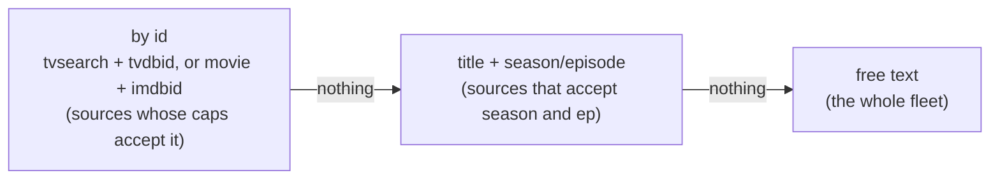

# Search sources & NZB-first

Manual grabbing (paste a magnet or a link and hand it to a client) always
works. On top of that, acquire can **search your sources and grab the best
release by itself** — the “find & grab” button. This page explains where it
searches, how it spends a source's allowance, how the winning release is
chosen, and why a source's API key never leaves acquire.

acquire ships **no sources**. You add the newznab (usenet) and torznab
(torrent) endpoints you are entitled to use, with your own keys.

## Search sources

A search source is one endpoint acquire queries directly:

| Field | Meaning |
|---|---|
| name | unique; shown on every release it offers |
| protocol | `usenet` (a newznab API, answers with NZBs) or `torrent` (a torznab API) |
| address + API path | the request goes to `address + path` — `/api` for most sources |
| API key | write-only; stored encrypted, sent only by acquire |
| categories | the category ids a movie search and a TV search are scoped to |
| priority | lower is asked first within a protocol |
| queries per day / downloads per day | the source's daily allowance; empty is no limit |

Sources are added and edited in the console under **search sources**, or
through the admin API:

| Method | Path | Purpose |
|---|---|---|
| `GET` | `/api/indexers` | every source with its caps, health and today's usage |
| `POST` | `/api/indexers` | add a source (its caps are read right away) |
| `PUT` | `/api/indexers/{id}` | replace a source's fields — send `If-Match: <revision>` |
| `DELETE` | `/api/indexers/{id}` | remove a source — send `If-Match: <revision>` |
| `POST` | `/api/indexers/test` | try a source that is not saved (or an edit of one that is) |
| `POST` | `/api/indexers/{id}/test` | try a saved source as stored |

A stale `If-Match` gets `409`; invalid fields get
`422 {"fieldErrors":[{"entity","id","field","message"}]}`. The key follows the
write-only rule of every secret in acquire: omit it to keep the stored one,
send a string to replace it, send `{"clear":true}` to remove it. A read only
ever says `{"set":true,"updatedAt":…}`. Every write is recorded in the settings
audit — who, what, when, never the value.

Storing a key needs `ACQUIRE_CONFIG_KEY` (see [Deploying](./deploying.md)).
Without it a key write is refused with `409` and setup says why; a public
source without a key can still be added.

The address is checked when it is saved and again whenever acquire connects:
only `http` and `https`, no credentials or query in the address, never a
link-local or cloud metadata address, nothing `ACQUIRE_ENDPOINT_DENY` names,
and no cluster service in another namespace — written out or as a short name
the cluster's DNS search list completes — unless
`ACQUIRE_ENDPOINT_ALLOW_INTERNAL=true`.

## Caps

`t=caps` is the source's own description of what it answers: its page size,
which of `search`, `tv-search` and `movie-search` it offers with which
parameters, and its category tree. acquire reads caps when a source is saved,
when it is tested, and once a day. The console uses the category tree so the
movie and TV categories can be ticked rather than typed.

Caps are a **hint**, not a contract — some sources advertise `tvdbid` and
return nothing for every id query. They decide where to ask first; a broader
query always stands behind them.

## Health, backoff and allowances

Every request's outcome is recorded against the source:

| Outcome | What happens |
|---|---|
| success | the failure count, backoff and last error are cleared |
| the key is rejected — HTTP `401`/`403`, or newznab error `100`–`102` | the source is **disabled** with the reason; asking again only risks a ban. Fix the key and enable it again |
| rate limited (`429`, newznab `500`/`501`), a `5xx`, a timeout or a connection failure | the source **backs off**: 5 minutes, doubling per consecutive failure, at most 6 hours |
| anything else (a wrong path, something that is not a feed) | recorded as the last error |

Health is stored, so a restart does not forget that a source is rate-limiting
acquire. Disabling a source because its key was rejected counts as a
configuration change (it moves the revision and is audited); the rest does
not, so a search never invalidates an editor that is open.

Each query and each release file download is counted per source per UTC day.
The count and the limit are checked in one statement, so concurrent searches
cannot overspend. A source at its query limit is not asked; a release from a
source at its download limit is not fetched, and auto-grab moves on to the next
release.

The **fleet** — the sources a search asks — is every enabled source that is not
backing off, has allowance left, and whose key can be opened.

## Searching

At most **four** requests to sources run at once across all of acquire, so a
sweep, a manual search and a test together cannot hammer a source.

**Manual search** (the search tab, and the release picker of a request) is free
text across the fleet, the preferred protocol's sources first. It answers
within **50 seconds**, giving each source at most 20, with whatever arrived:

```json
{ "candidates": [ … ], "incomplete": ["slow-source", "backing-off-source"] }
```

`incomplete` names every source in scope that did not answer in full — timed
out, failed, or could not be asked. Running out of the search's own 50 seconds
is not held against a source; only its own 20-second timeout is.

**Tracked targets** (the backlog) are searched with typed queries, escalating
from precise to broad and stopping at the first stage that finds something:



An empty typed stage is inconclusive, never proof of absence. Every result is
checked against the title (or a known alias) and the episode coordinates before
it is ranked — the free-text stage is where another show with a similar name
arrives.

## Choosing a release

Releases are scored by the **quality profile** (settings): resolution, source
(remux, Blu-ray, WEB-DL …), codec, size bounds per resolution, reject terms,
language count and seeders. The console shows the score and the reasons next
to every release, and what the profile rejects is shown greyed out.

**Auto-grab** is NZB-first by default. It searches the preferred protocol's
sources first and asks the others only when that finds nothing the profile
accepts — every query spends allowance. The preference is **search first** in
settings → search and grab; the environment variable `ACQUIRE_PREFER` only
seeds it on first boot.

## Keys never leave acquire

A usenet source's download link carries the source's API key. acquire keeps it
to itself:

- **Search results** handed to the console carry the link with its credentials
  (`apikey`, `r`, `passkey`, `token`) removed, plus an opaque **release
  reference** sealed with a key that exists only for the life of the process.
  A grab sends the reference back; acquire resolves the real link itself. A
  reference from before a restart, or older than a day, is refused — search
  again.
- **Release files** are fetched by acquire (an NZB up to 50 MiB, a `.torrent`
  up to 10 MiB) and handed to the download client as content, never as a link.
  A torrent with a magnet goes as the magnet, which carries no source key.
- **Grabs** record the redacted link, the source id and the release guid; the
  full link is kept only encrypted.
- **Errors** carry no request URL, and anything a source echoes back has the
  key cut out.

## Routing to a download client

A release goes to the enabled download client that handles its protocol,
lowest priority first (see [Download gateway & clients](./download-gateway.md)).
The client is chosen, and free space and the concurrency cap are checked,
**before** the release file is fetched, so a grab refused for want of a client
or disk does not spend the source's download allowance. When no client handles
the protocol the grab is refused with “no download client handles usenet — add
one under download clients”, and the request is left as it was.

The request's status then reads, e.g., `grabbed NZB from example via nzbget`.

## Setup and health

The **sources** section of `GET /api/setup` (and the setup checklist the
platform shows) is:

- `needs-setup` — no source exists, or none is enabled;
- `degraded` — a source's key cannot be opened (for example
  `ACQUIRE_CONFIG_KEY` changed without keeping the old key in
  `ACQUIRE_CONFIG_KEY_PREVIOUS`), or every enabled source is backing off or out
  of allowance;
- `ready` — otherwise, with the sources that are waiting named in the summary.

`/api/health/system` reports `sources` as failing when nothing can be asked
right now, and `/api/config` turns auto-grab on only when a source and a client
for its protocol both exist.

## Moving from an aggregator

Earlier versions searched through an external aggregator configured with
`INDEXER_URL` / `INDEXER_API_KEY` (or their older aggregator-specific
spellings). Those variables are no longer read; acquire logs one line at start
when one is still set. Add each source under **search sources** with its own
address and key, and remove the aggregator from the deployment.
